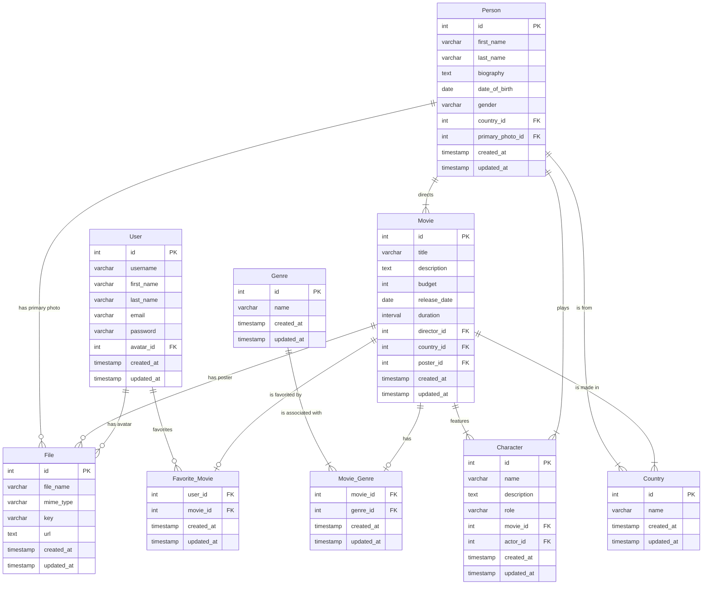

# ER Diagram

```mermaid
erDiagram
    User {
        int id PK
        varchar username
        varchar first_name
        varchar last_name
        varchar email
        varchar password
        int avatar_id FK
        timestamp created_at
        timestamp updated_at
    }
    File {
        int id PK
        varchar file_name
        varchar mime_type
        varchar key
        text url
        timestamp created_at
        timestamp updated_at
    }
    Movie {
        int id PK
        varchar title
        text description
        int budget
        date release_date
        interval duration
        int director_id FK
        int country_id FK
        int poster_id FK
        timestamp created_at
        timestamp updated_at
    }
    Person {
        int id PK
        varchar first_name
        varchar last_name
        text biography
        date date_of_birth
        varchar gender
        int country_id FK
        int primary_photo_id FK
        timestamp created_at
        timestamp updated_at
    }
    Character {
        int id PK
        varchar name
        text description
        varchar role
        int movie_id FK
        int actor_id FK
        timestamp created_at
        timestamp updated_at
    }
    Genre {
        int id PK
        varchar name
        timestamp created_at
        timestamp updated_at
    }
    Country {
        int id PK
        varchar name
        timestamp created_at
        timestamp updated_at
    }
    Favorite_Movie {
        int user_id FK
        int movie_id FK
        timestamp created_at
        timestamp updated_at
    }
    Movie_Genre {
        int movie_id FK
        int genre_id FK
        timestamp created_at
        timestamp updated_at
    }

    User ||--o{ File : "has avatar"
    Movie ||--o{ File : "has poster"
    Person ||--o{ File : "has primary photo"
    Person ||--|{ Movie : "directs"
    Person ||--|{ Character : "plays"
    Movie ||--|{ Character : "features"
    Movie ||--o| Favorite_Movie : "is favorited by"
    User ||--o{ Favorite_Movie : "favorites"
    Movie ||--o| Movie_Genre : "has"
    Genre ||--|{ Movie_Genre : "is associated with"
    Movie ||--|{ Country : "is made in"
    Person ||--|{ Country : "is from"
```
